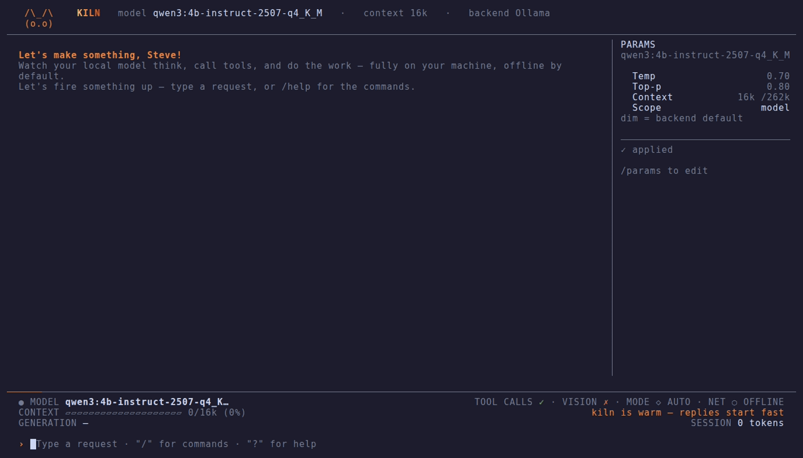

# Kiln

A lightweight, local-first terminal AI coding agent — **Claude Code for your own GPU**.



Kiln runs agentic coding entirely on a **local model backend** —
[LM Studio](https://lmstudio.ai), [Ollama](https://ollama.com), or any
OpenAI-compatible endpoint (llama.cpp, vLLM, …). It is not an IDE and not a
multi-provider cloud tool: one terminal app, one job — make local-model agentic
coding reliable and visible.

Kiln is a thin layer. It does **not** reimplement the agent loop, tool calling, or
file editing — that's [opencode](https://opencode.ai). Kiln drives opencode for the
agent work and talks to your chosen backend's control channel for model management.

## How it works — two channels

```
  [Kiln]  ──(agent:  @opencode-ai/sdk)──▶  opencode server  ──┐
  [Kiln]  ──(control: ControlChannel)────▶  backend            │ inference
                                                  ▲            │ (OpenAI /v1)
                                                  └────────────┘
                                          opencode → backend's OpenAI endpoint
```

- **Agent channel** — Kiln starts a headless `opencode serve` and talks to it via
  `@opencode-ai/sdk`. opencode reaches the model through the backend's
  OpenAI-compatible endpoint (LM Studio `:1234/v1`, Ollama `:11434/v1`, or a URL you
  supply).
- **Control channel** — a backend-agnostic interface for model management
  (list/load/unload, read context length & capabilities). LM Studio and Ollama get a
  full native control channel; a generic OpenAI endpoint is inference-only, so Kiln
  greys out what it can't do instead of faking it.

Where the backend can report it, Kiln reads each model's real capabilities over the
control channel — its **actual loaded context length** and whether it's
**tool-capable** — and auto-configures opencode's provider for that specific model.
No hand-editing of context windows or tool flags. (Reasoning/"thinking" stays off
unless you opt in; see `KILN_ENABLE_REASONING` below.)

See [`AGENTS.md`](./AGENTS.md) for the full architecture and ground rules.

## Prerequisites

The installed Kiln binary is **self-contained** — it embeds the Bun runtime, so you do **not**
need Bun or the source to run it. You need two things:

1. **The `opencode` CLI** on your `PATH` — Kiln drives it for the agent loop; it is **not**
   bundled (it's a separate program Kiln spawns). **The installer installs it for you** if it's
   missing; or get it from [opencode.ai](https://opencode.ai) and confirm `opencode --version`
   works in a fresh terminal.

2. **A running model backend** — one of:
   - **LM Studio** — ⭐ **recommended.** Local server on port 1234 (Developer → **Start
     Server**). Verify: `curl http://localhost:1234/v1/models` returns JSON. *Richest
     backend — Kiln can load/unload models and read their real capabilities, and it serves
     each model's full context with no extra configuration.*
   - **Ollama** running on port 11434 (`ollama serve`, then `ollama pull <model>`).
     Verify: `curl http://localhost:11434/api/tags` returns JSON. **Important:** Ollama's
     OpenAI endpoint serves a **4096-token** context by default and silently truncates
     longer prompts — too small for agentic work. Start it with a bigger context:
     `OLLAMA_CONTEXT_LENGTH=16384 ollama serve` (`kiln doctor` warns if it's unset).
   - **Any OpenAI-compatible endpoint** (llama.cpp, vLLM, …) that serves `/v1`. You
     supply the URL during onboarding. *Inference-only — no load/unload, and you tell
     Kiln the context length, since the endpoint can't report it.*

3. **At least one downloaded/pulled chat model** on that backend (a tool-capable
   model is strongly recommended, since file editing relies on tool calls).

> Building Kiln **from source** (not needed to use it) additionally requires **Bun ≥ 1.3** —
> see [Developing Kiln](#developing-kiln).

On first launch Kiln runs a short **onboarding** wizard — your name, how experienced
you are with local models, which backend to use, and the default model — and remembers
your choices. If you say you know your way around, you go straight to setup; otherwise
Kiln shows a short guide first: what Kiln is, what **your** machine can run (it reads
your GPU and names the best pick from its catalog), what to honestly expect from local
models, and — if no backend is installed yet — the exact install steps for your OS
(it re-checks live once you've installed one). Re-run it any time with `kiln onboard`,
or the `/onboard` command inside the app.

## Install

Kiln ships as a **standalone binary** — no source, no build step, no Bun to install. One command
detects your platform, downloads the matching binary from the latest GitHub Release, **verifies
its SHA256**, puts `kiln` on your PATH, and installs `opencode` if it's missing.

```sh
# macOS / Linux
KILN_REPO=OWNER/kiln  curl -fsSL https://raw.githubusercontent.com/OWNER/kiln/main/scripts/install.sh | bash
bash install.sh --uninstall          # remove kiln + the PATH line it added
```
```powershell
# Windows
$env:KILN_REPO="OWNER/kiln"; irm https://raw.githubusercontent.com/OWNER/kiln/main/scripts/install.ps1 | iex
```

- Replace `OWNER/kiln` with the **public release repo** (or pass `KILN_REPO=owner/repo`). Pin a
  version with `KILN_VERSION=vX.Y.Z` (default: the latest release, prereleases included).
- The installer is **idempotent** (safe to re-run). It can't install a model backend for you —
  see [Prerequisites](#prerequisites) (**LM Studio recommended**).
- **macOS:** the binary is unsigned; the installer clears the download quarantine, but if
  Gatekeeper still blocks it, run `xattr -d com.apple.quarantine "$(command -v kiln)"`.

Then:

```sh
kiln doctor    # check backend reachability, models + tool support, VRAM fit, opencode
kiln           # start (first run walks you through setup)
```

Drive everything through the `kiln` command:

| Command | What it does |
|---|---|
| `kiln` / `kiln start` | Launch Kiln (the default) |
| `kiln onboard` | Re-run the setup wizard (name, backend, model) |
| `kiln plain` | Launch the plain readline REPL (no TUI) |
| `kiln doctor` | Check your setup — opencode, backend reachability, models + tool support, VRAM fit, what's resident — and print fixes for anything wrong |
| `kiln bench` | Measure your setup's speed — opencode startup, model-load, time-to-first-token, generation tok/s. `kiln bench [runs]` |
| `kiln version` | Show Kiln, Bun, and opencode versions (and the pinned SDK) |
| `kiln help` | Show usage |

Options after the command are forwarded, e.g. `kiln start --plain`.

**Resume a previous conversation** with a session flag (opencode persists sessions on
disk per project): `kiln --resume` (or `-c`) reopens the last session in this directory,
`kiln --session <id>` reopens a specific one, and `kiln --new` forces a fresh session.
Inside the app, use `/sessions`, `/resume`, and `/new`.

> **Platform support.** Kiln is developed and run daily on **macOS**; Linux should
> behave the same. **Windows** support has been audited and cross-platform-fixed but
> is **pending verification on a real Windows machine** — if you're on Windows, follow
> [`WINDOWS_TESTING.md`](WINDOWS_TESTING.md), which walks the install and a full smoke
> test and tells you exactly what to report. Use a **modern terminal** — Windows
> Terminal, the VS Code integrated terminal, or PowerShell 7 — for correct box-drawing
> glyphs and truecolor; the legacy `conhost` window may render the cockpit's rules and
> bars poorly.

## Using Kiln

1. Kiln connects to your chosen backend and reads its available models. It
   **selects** a default — your saved choice from `/settings`, or the largest model
   if you haven't picked one — and shows it in the cockpit as `standby`. Then it
   quietly **preheats**: it loads that model in the background and warms the backend's
   prompt cache with a throwaway turn, so your **first real prompt skips the cold
   prefill** — the cockpit narrates `firing up the kiln…`, then `kiln is warm —
   replies start fast`. You can still switch with `/model` first; set `KILN_PREHEAT=0`
   to skip the warm-up and load lazily on your first prompt instead. (On a backend
   that can't load models, like a generic endpoint, the model is simply the one the
   server already serves.)
2. Kiln starts the opencode agent and opens the **full-screen TUI** (it takes over the
   terminal's alternate screen, like `vim`/`less`, and restores it untouched on exit). It
   opens with a friendly greeting (`Welcome back, <you>!`), and a little **ember-fox mascot**
   (`/\_/\` · `( o.o )`) curls up in the top-left corner. It waves hello on first launch, then
   rests calmly — every several seconds a quiet blink, the odd glance or grin — and **reacts to
   the model**: its eyes scan while the prompt is read, a `?` pops up while it thinks, and it
   gets a focused `< > /` "coding" look while it works. The design is
   deliberately minimal — near-monochrome, with a single warm **ember** accent for active
   states. The layout is fixed: a slim header, a **scrollable transcript** that fills the
   height, a persistent **parameter rail** down the right edge, and the **cockpit** + input
   pinned at the bottom. Since the alternate screen has no native scrollback, the transcript
   scrolls **in-app** (PageUp/PageDown, or arrows when it has focus).
3. Type a coding request, e.g. `create a hello world http server in node`. By the time
   you send your **first prompt** the model is usually already warm (the preheat above);
   if it isn't — preheat off, or you just switched models — Kiln loads it now (the
   cockpit shows the load). Then
   opencode works — assistant text streams in, then renders as clean **Markdown** once
   the turn finishes, and tool activity (file writes, shell, etc.) shows as compact rows
   that update in place: a dim verb (RUN/EDIT/READ/…), the target, a status glyph, and a
   muted **diff preview** for edits.

### Input & key bindings

You type in the **input** by default. `Tab` focuses the **transcript** so you can scroll it
with the arrows; type **`/params`** to jump into the **parameter rail** and edit it. `Esc`
always returns you to the input. The prompt itself is a small multi-line editor:

| Key | Action |
|---|---|
| `?` | Open the **help overlay** (commands + keys) — press on an empty line (or `/help`) |
| `Enter` | Submit the prompt |
| `Ctrl+J` (or `Alt`/`Option`+`Enter`) | Insert a newline (terminals can't see Shift+Enter). **On Windows use `Ctrl+J`** — `Alt+Enter` may not register in some terminals. |
| `↑` / `↓` | Recall your previous / next prompt (command history) — when the **input** has focus |
| `←` / `→` | Move the cursor |
| `Tab` | Focus the **transcript** to scroll it (Esc returns to the input) |
| `Shift+Tab` | Cycle the **autonomy mode** — plan → ask → act → auto (live, mid-session; see `/mode`) |
| `PageUp` / `PageDown` | Scroll the transcript (works from any focus, even mid-turn) |
| **Mouse wheel** | Scroll the transcript up/down (via the terminal's alternate-scroll mode, so **normal text selection still works** — no Shift needed). Also `PageUp`/`PageDown` from anywhere. |
| `↑` / `↓` / `g` / `G` | Line-scroll / jump to top / bottom — when the **transcript** has focus |
| `/params` | Focus the **parameter rail** to edit temp / top-p / context |
| `Ctrl+B` | Collapse / expand the parameter rail |
| `Esc` (from transcript/rail) | Return focus to the input |
| `Esc` (while idle, input focused) | Clear the current line |
| `Esc` (while a turn is running) | **Interrupt** the turn — stops generation without quitting |
| `Ctrl+C` | Quit cleanly (unload + shutdown, terminal restored) |

Type `/` and Kiln shows the matching slash-commands beneath the prompt.

### The parameter rail

Down the right edge, a persistent rail shows the active model's inference params and lets you
edit them inline. It shows the **value actually in force** — never just the word "default":
a param you haven't set displays the real number it resolves to (the model's own default from
its metadata, e.g. an Ollama Modelfile, else the backend's documented default), shown **dim**
to mark it as inherited; context shows the length the model is actually serving, with the
model's `/max` cap. Type **`/params`** to focus it, then `↑`/`↓` to pick a field (temperature,
top-p, context, scope) and `←`/`→` to change it (temperature/top-p step by 0.05 within 0–1,
or back to the backend default; context cycles the presets); `Esc` leaves the rail. Edits **save immediately** to `~/.kiln`. Because
opencode resolves sampling params once when the agent starts, the rail marks edits **`● edited
— a to apply`**; press `a` to apply them this session — Kiln does one quick agent hot-swap
(reusing the `/onboard` machinery, so your transcript/session is preserved) and the new
temperature/top-p take effect on your next prompt (context reloads the model at the new size).
`r` resets the current scope. `Ctrl+B` hides the rail to give the transcript more width. (The
requested context is capped at the model's real max when the model loads.) Your rail
**scope** (global vs this-model) and whether it's **collapsed** are remembered across
launches.

### The cockpit

A bordered panel pinned below the transcript shows, at a glance:

- the **active model** (● + name) and its capabilities — `[tools]` / `[no tools]`,
  `[vision]` — and its **max context**. During a turn that **hierarchy routing** sends to
  the small model, the name switches to the model actually answering with a `↘ routed`
  marker, so the generation rate is never misattributed;
- what the model is doing right now — `standby` (selected, not loaded), `idle`, or, during a
  turn, the live phase: **`processing prompt… 1.8s`** (prefilling, with the exact prompt-token
  size once opencode reports it), **`thinking…`** (reasoning, if the model reasons),
  **`working…`** (running a tool), and **`generating · 2,418 tokens · 5.2s`** (the **exact**
  live token count and elapsed time);
- a **`MODE` badge** showing where the autonomy dial sits — `PLAN` / `ASK` / `ACT` /
  `AUTO` — so you always know how much the agent will do without asking (`Shift+Tab`
  cycles it; see [Slash commands](#slash-commands));
- **throughput** as two rates (full words, on their own cockpit row): **`GENERATION`** is
  the decode rate in `tokens/sec`, measured over the decode windows of the turn's text
  steps only — not blurred by prefill or tool time — and **`PREFILL`** is the prompt-eval
  rate (prompt tokens ÷ time-to-first-token, from the turn's first, cold prefill), shown
  when the window is wide enough and the prefill is measurable. Both accumulate across a
  turn's multiple steps, so the meter never dips mid-turn. These mirror
  LM Studio's and Ollama's own
  prefill/decode phases. **Identical math for both backends:** opencode drives inference
  over each backend's OpenAI-compatible endpoint, which strips Ollama's native
  `eval`/`prompt_eval` counts and LM Studio's prediction stats, so Kiln derives both rates
  from opencode's stream timing instead — the same way for every backend, so the readout
  is at parity by construction. (A true prefill *percentage* still isn't shown — the
  native progress signal isn't observable over that endpoint — and where a window can't be
  measured the rate is hidden rather than faked. Every count and timing is exact and real.);
- a **context-budget meter** (`context 12k/16k (75%)`) that turns yellow as you approach
  the window and warns when compaction is near;
- a **cloud-savings odometer**: on wide terminals the session total shows
  `≈$X.XX cloud avoided` — what this session's tokens would have cost on a metered
  cloud API, at a deliberately round blended reference price of **$6 per million
  tokens**. It's marked `≈` for a reason: a vibe-accurate odometer, not an invoice.
  (`--plain` prints the same figure as a goodbye line when you quit.)

These numbers are read from the control channel (max context) and the live turn
(everything else) — Kiln never guesses. The `--plain` CLI prints the same readout
(`38 tokens/sec generation · 420 tokens/sec prefill`) after each turn.

### Slash commands

- **`/model`** — open a picker to change the **selected** model. Move with ↑/↓ (or
  `j`/`k`), jump with number keys, `Enter` to select, `Esc` to cancel, `b` to switch
  **backend** (see `/backend`). This only changes
  which model is selected — it loads on your **next prompt**, not immediately, so you can
  switch freely without committing VRAM. The context meter resets on the next load.
  Models you've `/verify`'d show their verdict right in the picker — `✓ tools verified`
  or `⚠ tools fail live`. A model you pull *after* Kiln launched is registered
  automatically (a quick agent bounce that keeps your session), so it's switchable right
  away — no restart needed.
- **`/mode`** — the **autonomy mode dial**: how much the agent may do without asking.
  Four positions, most careful first:
  - **plan** — read-only. Kiln reads, greps, and proposes; every file edit and shell
    command is auto-rejected with a notice.
  - **ask** — confirm everything: every file edit **and** every shell command asks first.
  - **act** — file edits run freely; shell commands still ask.
  - **auto** — full autonomy, nothing asks. The default.

  Cycle it live with `Shift+Tab` (TUI) or `/mode`, or jump straight to a mode with
  **`/plan`**, **`/ask`**, **`/act`**, **`/auto`** (all of these work in `--plain` too).
  The dial applies **immediately, mid-session** — no restart — and the cockpit shows a
  `MODE` badge so you always know where it sits. When a mode asks, Kiln pops an approval
  prompt mid-turn: `y` allow once, `a` allow for the session, `n`/`Esc` reject.
- **`/backend`** — switch the **backend** — LM Studio / Ollama / generic endpoint —
  **live**, without quitting. The picker shows each one's live status (`● running` /
  `○ not detected`); pick with ↑/↓ + `Enter`, or jump with `1`–`3` / `l` / `o` / `g`.
  Kiln stands the agent back up on the new backend and **reattaches your conversation**.
  Also reachable with `b` from the `/model` picker and `/settings`.
- **`/models`** — **discover models worth running on your hardware.** A curated,
  hand-verified catalog of local models that are genuinely good at agentic work,
  filtered to the ones that fit **your** machine (VRAM-aware), with task tags
  (`coding` / `chat` / `vision`), honest cautions (thinking burn, version gates, …),
  and the exact `/pull` command for each. The curation is opinionated on purpose —
  every entry was verified to actually drive tools. qwen2.5-coder, for example, is
  deliberately absent: it advertises tool support but emits its calls as plain text
  through Ollama, which silently breaks agentic use.
- **`/verify`** `[model]` — **prove a model can really call tools** before trusting it
  with your files. Backend capability flags can lie (see qwen2.5-coder above), so this
  sends one real request with a tools array to your backend and checks whether a
  **structured** tool call comes back — burning a few hundred local tokens to validate
  a model is exactly the kind of thing a metered cloud tool would never do. The verdict
  persists and shows in the model pickers as `✓ tools verified` / `⚠ tools fail live`.
  (The backend will JIT-load the model if it isn't resident — the honest cost of a real
  answer.)
- **`/duel`** `[opponent] <prompt>` — **one prompt, two local models, honest numbers.**
  Runs your prompt through the active model **and** an opponent (name one, or let Kiln
  pick), back to back in throwaway sessions, then shows the answers side by side with
  first-token time, tok/s, token counts, and a speed verdict. On a metered API nobody
  double-spends every prompt for sport; on your own GPU the second opinion is free —
  great for picking a daily-driver model in minutes. Tools are auto-rejected during a
  duel (it's an answer bake-off, not a race to edit your files).
- **`/params`** — focus the **parameter rail** to edit temperature / top-p / context for the
  active model inline (`↑`/`↓` field, `←`/`→` change, `a` apply, `Esc` leave). See
  [The parameter rail](#the-parameter-rail).
- **`/sessions`** — open a **finder** over your **past sessions** in this project (most
  recent first). **Type to filter** by title, `↑`/`↓` to move (long lists scroll with a
  "↓ N more" hint so nothing clips), `Enter` resumes the highlighted one (restoring its
  transcript) or starts a fresh session if you're on the top row, `Ctrl+D` deletes the
  highlighted session, `Esc` clears the filter (or closes). opencode persists every
  session on disk per project, so your conversations survive across launches and live
  entirely **on your machine** (no cloud, no session sharing).
- **`/rename`** `<title>` — **rename the current session** (the new title shows in the
  `/sessions` finder and persists). The finder already **searches** — type to filter by title.
- **`/resume`** — jump straight back into your most recent previous session.
- **`/new`** — start a fresh session, clearing the transcript.
- **`/export`** `[path]` — save the current conversation (your prompts, the assistant's
  replies, and the tool activity) to a **Markdown file** — handy for notes, sharing a snippet,
  or keeping a record. It's a plain **offline** file write (Kiln has no cloud session sharing):
  the file lands in your current directory as `kiln-<title>-<timestamp>.md` (or at a path you
  give), and Kiln prints where it wrote it. Works in the TUI and `--plain`.
- **`/settings`** — preferences:
  - **Default model** (press `d`) — opens the picker to choose which model Kiln selects
    at startup. The choice persists to `~/.kiln/settings.json`; if it's no longer
    downloaded later, Kiln falls back to the largest downloaded model.
  - **Parameters** (press `p`) — tune **temperature**, **top_p**, and **context length**,
    with one-key local-coding presets (Default / Precise / Balanced / Creative) and a
    tradeoff note. Set them globally or **per-model** (press `m` to switch scope). `Default`
    leaves sampling to the backend (Kiln's out-of-the-box behavior). Changes persist and
    take effect on the next launch (or `/onboard`) — opencode resolves these at agent start.
  - **Mode** (press `a`) — cycle the **autonomy mode dial** (plan / ask / act / auto;
    see `/mode` above). Like everywhere else on the dial, it applies **immediately** —
    this session included, no restart.
  - **Backend** (press `b`) — switch LM Studio / Ollama / generic endpoint live (see
    `/backend` above).
  - **Web access** (press `w`) — Kiln is **offline by default**. This toggle is the only
    thing that lets the agent reach the internet; it's clearly labeled and starts **off**, and
    it governs **both** of opencode's web tools: **`webfetch`** (retrieve a URL — needs no
    key) and **`websearch`** (discovery — needs a search provider; see below). Both are denied
    when off and allowed when on. Takes effect on the next launch (or `/onboard`).
  - **Model hierarchy** (press `h`) — opt-in routing. When **on**, pick a **main** model
    (press `m`) and a faster **small** model (press `s`); Kiln then routes *simple* turns to
    the small model and keeps *real coding* work on main. It's heavily guarded: it only
    engages when **both models are already loaded** (it never triggers a reload), never sends
    a tool-using turn to a model without tool support, and stands down if you `/model` to
    something else. Off by default — Kiln stays single-model. On a small GPU two useful models
    usually can't co-reside, so routing stays inert there by design (see below).
  - **MCP servers** (press `c`) — manage Model Context Protocol servers (see `/mcp` below).
- **`/mcp`** — manage **MCP servers**: extra tool providers opencode connects to so the agent
  can do things beyond Kiln's built-in tools (git, databases, web services, …). The overlay
  lists your configured servers with their **live connection status** (connected / disabled /
  failed) and a short **catalog** of well-known servers you can add with one keystroke; `Enter`
  toggles a server on/off (or adds a suggested one), `x` removes, `Esc` closes. Kiln is
  **offline-first**, so the default is **no servers** — you opt in. A server's first run
  downloads it (the catalog ones run via `npx`, so Node is required), and changes apply on the
  next launch. In `--plain`, use `/mcp`, `/mcp add <name> [local <cmd…> | remote <url>]`, and
  `/mcp enable|disable|remove <name>`. Reuses opencode's native `mcp` config — Kiln doesn't
  reinvent the connection.
- **`/pull`** `[model]` — **download a model from inside Kiln** (Ollama *and* LM Studio).
  With no argument it
  lists a few solid local-coding models that **fit your GPU** (VRAM-aware, with a `fits`/`tight`
  badge); with a name it downloads it with live byte progress — an Ollama tag
  (`/pull qwen3:4b-instruct-2507-q4_K_M`) or an LM Studio catalog name (Kiln finds it in
  the LM Studio catalog and picks LM Studio's own recommended quant). After a pull the
  model is registered automatically — pick it with `/model` to start using it. (A generic
  endpoint can't pull.) Recently-used models are marked `· recent` in
  the `/model` picker.
- **`/image`** `<path>` — **stage an image for your next prompt** (for vision-capable models).
  Reads a local image and attaches it to the next message. ⚠️ **Heads-up:** on the current
  opencode build images aren't actually forwarded to the model over the local OpenAI-compatible
  endpoint (we verified this and chose not to hack opencode's pipe) — so this is **groundwork +
  the affordance**, honestly caveated when you use it; it'll start working once opencode adds
  proper image forwarding. `/image clear` drops a staged image.
- **`/reconnect`** — **restart the agent server, keeping this session.** If the opencode
  agent or the backend drops mid-session (you'll see a clear "type /reconnect" hint), this
  rebuilds the agent on your current settings and **reattaches the same conversation** (opencode
  persists it on disk, so nothing is lost) — then carry on. Also handy if anything feels stuck.
- **`/onboard`** — re-run the setup wizard (name, backend, model) **without leaving
  Kiln**. Switching backend or model here does a live hot-swap: Kiln restarts the
  agent on your new choice and starts a fresh session — no need to quit and relaunch.
- **`/exit`** (or `Ctrl+C`) — quit cleanly. Kiln **unloads any model it loaded**, shuts
  down the opencode server and the control channel, and Ink restores your terminal — no
  orphaned `opencode serve` and no model left occupying VRAM.

> **Single model, kept warm.** By default Kiln runs everything on the one model you
> pick. At launch it preheats that model in the background (with `KILN_PREHEAT=0`, or if
> you act before the warm-up finishes, it loads lazily on your first prompt instead),
> keeps just that one model
> resident (any *Kiln-loaded* extras are unloaded so a single model stays in VRAM), and
> unloads what it loaded when you quit. Models **you** had loaded are left untouched.
> **Routing** (the hierarchy toggle) is opt-in and never reloads: it only picks between models
> you *already* have resident, so on a typical single-GPU box — where two useful models won't
> fit at once — it simply stays inactive. It's there for setups with the VRAM to keep a small
> and a large model loaded together.

### Plain mode

Prefer a classic line-by-line REPL (or your terminal can't host the Ink TUI)?
Launch with `kiln plain` (or `kiln start --plain`, alias `--no-tui`):

```sh
kiln plain
```

Plain mode keeps the readline prompt and the same commands — `/model`, `/mode` (with the
`/plan` / `/ask` / `/act` / `/auto` shortcuts), `/backend`, `/models`, `/verify`, `/duel`, `/sessions`,
`/resume`, `/new`, `/rename`, `/params`, `/web`, `/airgap`, `/hierarchy`, `/mcp`, `/perf`, `/export`, `/pull`, `/image`, `/reconnect`, `/tour`, `/exit` — printing streamed output line by
line instead of in the TUI. It also honours the `--resume` / `--session` / `--new` startup
flags. Run a command with no args for usage (`/params preset balanced`, `/mode ask`,
`/web on`, …); in the **ask** and **act** modes it prompts inline before the agent edits a
file or runs a command (`/approve` still works — it's an alias of `/mode`). When you quit,
plain mode says goodbye with the session's token count and what those tokens would have
cost on a metered cloud API.

> Kiln operates in the **current working directory** — opencode reads and writes
> files there. Run `kiln` from the project you want it to work in.

## Configuration (environment variables)

Most users set nothing here — onboarding persists your backend and model to
`~/.kiln/settings.json`. These override those defaults for a one-off run.

| Variable | Default | Purpose |
|---|---|---|
| `KILN_BACKEND` | `lmstudio` | Force a backend for this run: `lmstudio`, `ollama`, or `generic` (overrides the onboarded choice) |
| `KILN_LMSTUDIO_WS` | `ws://127.0.0.1:1234` | LM Studio native (control) WebSocket URL |
| `KILN_LMSTUDIO_OPENAI` | `http://localhost:1234/v1` | LM Studio OpenAI endpoint opencode calls for inference |
| `KILN_OLLAMA_HOST` | `http://127.0.0.1:11434` | Ollama native REST API host (control) |
| `KILN_OLLAMA_OPENAI` | `http://127.0.0.1:11434/v1` | Ollama OpenAI endpoint opencode calls for inference |
| `KILN_GENERIC_OPENAI` | _(none)_ | Generic backend base URL (must end in `/v1`). Seeds onboarding; the saved value wins |
| `KILN_GENERIC_API_KEY` | `none` | Generic backend API key, or `none` to send no `Authorization` header |
| `KILN_GENERIC_MODEL` | _(none)_ | Generic backend fallback model id, used when `/v1/models` discovery is empty |
| `KILN_GENERIC_TOOLS` | `true` | Whether to tell opencode the generic model can tool-call (it can't be detected) |
| `KILN_OPENCODE_HOST` | `127.0.0.1` | Host the opencode server binds to |
| `KILN_OPENCODE_PORT` | `4096` | Port the opencode server listens on |
| `KILN_OPENCODE_TIMEOUT` | `60000` | ms to wait for opencode to start (first run may fetch the provider) |
| `KILN_CONTEXT_LENGTH` | `16384` | Context length requested when Kiln loads a model fresh (opencode's system prompt is ~9k tokens, so don't go much lower) |
| `KILN_PREHEAT` | `true` | Warm-up at launch (TUI): quietly load the default model and prime the backend's prompt cache with a throwaway turn, so the first real prompt skips the cold prefill. Set `0` to load lazily on your first prompt instead. |
| `KILN_ENABLE_REASONING` | `false` | Let opencode send reasoning/"thinking" requests. Off by default — LM Studio reports no reasoning capability, so enabling it for a model that doesn't support it can crash the turn. Set `1`/`true` only for models you know support thinking. |
| `KILN_IDLE_TTL` | `1800` | Seconds of inactivity after which a Kiln-loaded model auto-unloads to free VRAM. The timer resets on every request, so active sessions aren't interrupted; the next prompt JIT-reloads. Set `off` (or `0`) to keep the model resident. Only affects models Kiln loads. |
| `KILN_LEAN_TOOLS` | `true` | Trim opencode's tool set to a lean local-coding set (drops the `task`/`skill` tools and, when offline, the web tools) so the model **prefills less each turn**. The core file/shell tools (read/write/edit/bash/grep/glob) are always kept. Set `0` to send opencode's full tool set. |
| `KILN_DISABLE_LSP` | `true` | Skip opencode's LSP (language-server) integration — faster startup, no background servers. Local models don't lean on LSP diagnostics. Set `0` to let opencode run language servers. |

> **Local-speed optimization.** The local model's **prefill** (re-reading the system prompt +
> tool schemas every turn) is the bottleneck, not opencode — so Kiln trims what the model has to
> process. By default it sends a **lean tool set** (dropping the rarely-useful subagent/skill
> tools; the core file/shell tools always stay) and **disables LSP**. Both are reversible (the
> env vars above, or `--plain` `/perf lean on|off` / `/perf lsp on|off`), apply on the next
> launch, and never remove a tool that would break editing or running commands.

## Troubleshooting

- **"Couldn't reach the backend"** — the backend isn't running. Start LM Studio
  (Developer → Start Server, :1234), run `ollama serve` (:11434), or start your
  generic endpoint — then re-run onboarding if you need to point Kiln at it.
- **"Failed to start the opencode agent server"** — `opencode` isn't on your `PATH`,
  or the port is taken. Check `opencode --version`; set `KILN_OPENCODE_PORT`.
- **"No models are available"** — download/pull a chat model on your backend (LM
  Studio Discover tab, `ollama pull <model>`, or load one into your endpoint).
- **Generic endpoint stalls on a tool-heavy turn** — Kiln can't size the context
  window on a bare OpenAI endpoint, and opencode's system prompt is ~9k tokens. Serve
  the model with a large enough context out-of-band (the generic backend is best for
  endpoints you've already configured).
- **Model marked `[no tools]`** — file editing may not work; pick a tool-capable model.
- **`Failed to load model … (VRAM/RAM)`** — the model + context length likely don't fit
  in memory. Before loading a fresh model, Kiln prints a **best-effort fit estimate**
  (it reads unified memory on Apple Silicon, or NVIDIA VRAM via `nvidia-smi` on
  Windows/Linux). It's an estimate only — confirm the real fit in LM Studio. If a load
  fails, pick a smaller model or lower `KILN_CONTEXT_LENGTH`.

## Developing Kiln

> This section is for working **on** Kiln from a source checkout — **not needed to use it.**
> End users install the prebuilt binary (see [Install](#install)).

Kiln's **source is private**; the public-facing distribution is the compiled binary published to
a separate **public release repo**. Developing requires **Bun ≥ 1.3** (Kiln runs its TypeScript
directly under Bun — no Node/build step):

```sh
git clone <private repo> && cd kiln
bun install
bun run build         # type-check (tsc --noEmit)
bun test
bin/kiln              # the dev launcher: runs `bun run src/index.ts` (also: kiln dev / kiln build)
```

`bin/kiln` is the developer launcher and supports `kiln dev` (`--watch`) and `kiln build`
(`tsc`). The **compiled binary deliberately rejects these** — it ships no toolchain or source.

**Build the release binaries** (standalone, minified, no source maps; one per platform):

```sh
bun run build:binary       # just the host platform (fast)
bun run build:binaries     # all 5 targets → dist/ + SHA256SUMS + license notices
```

Releasing (tagging, the GitHub Action, the private→public split, setting the install repo URL)
is documented in **[RELEASING.md](RELEASING.md)** — those are the maintainer's manual steps.

## Alpha status

Kiln is an **open alpha** (`v0.1.0-alpha.1`). Here's the honest state of it:

**Works well today:** the full-screen TUI (cockpit, parameter rail, transcript), `--plain`
mode, LM Studio and Ollama backends, tool-calling (read/edit/write/shell), the autonomy
mode dial (plan/ask/act/auto), sessions
(resume/rename/export), model management (`/models`, `/pull`, `/verify`, `/duel`,
`/backend`, VRAM fit), the offline/airgap controls,
`kiln doctor`, and the one-command installer on macOS/Linux.

**Rough edges:**
- **Windows is unverified end-to-end.** The launcher and `install.ps1` are written to be
  cross-platform, but they haven't been run through a real Windows install yet. Expect to
  fix something; reports welcome.
- **Ollama** needs `OLLAMA_CONTEXT_LENGTH=16384` (or more) on the server for real agentic use
  (its `/v1` endpoint truncates to 4096 otherwise). **LM Studio** has no such caveat — hence
  it's the recommended backend.
- **Vision** depends on what your backend's OpenAI endpoint actually forwards; the affordance
  is there but image pass-through isn't guaranteed across backends.

See [CHANGELOG.md](CHANGELOG.md) for the full list. Questions, bugs, or feedback:
**stevemech2020@gmail.com**.

## Privacy & security

**Kiln collects nothing and sends nothing** — no telemetry, no analytics, no update checks.
See [PRIVACY.md](PRIVACY.md) for the details. In short: the model and agent run locally, your
sessions live under `~/.kiln/`, and you can run Kiln fully air-gapped.

Kiln is **offline by default** — the agent has **no internet access** until you opt in via
the **Web access** toggle (`/settings` → `w`, `--plain` `/web on`, or onboarding). When off,
both of opencode's web tools are denied (`webfetch` *and* `websearch`), so neither retrieval
nor discovery can reach out; everything else stays local on your machine. For a hard, provable
lockdown, turn on **strict airgap** (`/settings` → `g`, or `--plain /airgap on`): it forces all
web tools off regardless of any other setting, and the cockpit shows a `⊘ AIRGAP` badge.

**Web access on — what works:**
- **`webfetch`** (retrieve a specific URL) works immediately, no key needed.
- **`websearch`** (discover pages for a query) needs a **cloud search provider**, because
  opencode performs the search through one. Set **`EXA_API_KEY`** in your environment (a free
  tier is available at [exa.ai](https://exa.ai)) and Kiln passes it through to opencode
  automatically; alternatively run `opencode auth login` to use opencode's hosted search.
  Without a provider, web access still gives you `webfetch` — `websearch` simply returns
  nothing (Kiln never fakes results). Kiln does **not** store the key — it's read from your
  shell environment, in keeping with offline-first (no bundled search credentials).

By default the agent may edit files and run commands in your working directory **without
asking** (frictionless local coding — the **auto** mode). If you'd rather keep a hand on
the dial, turn down the **autonomy mode**: **act** still edits freely but asks before
shell commands, **ask** confirms every file edit and shell command, and **plan** is
read-only — mutating calls are auto-rejected outright. Cycle it live with `Shift+Tab` or
`/mode`; it applies immediately, mid-session, and the cockpit's `MODE` badge always shows
where you are. Until you turn the dial down, run Kiln in directories you trust.

## License

MIT. Kiln preserves the upstream notices of opencode (MIT) and the LM Studio SDK
(Apache-2.0) — see [`LICENSE`](./LICENSE).
